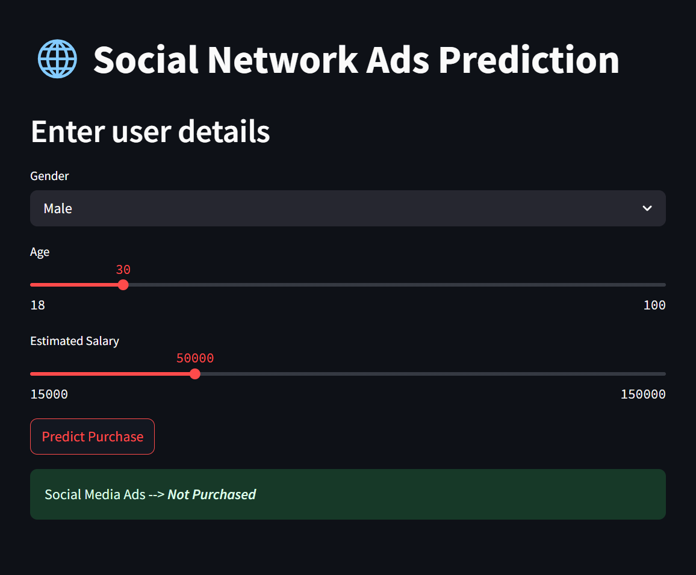

# 📊 Social Media Ads Purchase Prediction


A machine learning-powered web app that predicts whether a user will purchase a product based on their **Gender**, **Age**, and **Estimated Salary**.

Live App 👉 [Try It on Streamlit!](https://socialmedia-ads-purchase-prediction.onrender.com/)

---

## 🚀 Features

- 📈 Predict purchase behavior in real-time
- 🧠 ML pipeline with preprocessor and trained model
- 🌍 Deployed Streamlit UI for user interaction
- 🧪 FastAPI backend for live predictions
- ⚡ Clean and responsive UI with emoji-powered UX

---

## 🧰 Tech Stack

| Tool         | Role                          |
|--------------|-------------------------------|
| Streamlit    | Front-end / UI                |
| FastAPI      | Backend API for ML model      |
| scikit-learn | ML modeling & preprocessing   |
| Python       | Core language                 |
| Uvicorn      | ASGI server for FastAPI       |

---

## 🛠️ Setup Instructions

1. **Clone the repository**  
```bash
git clone https://github.com/davutbayik/socialmedia-ads-purchase-prediction.git
cd socialmedia-ads-purchase-prediction
```

2. **Install dependencies**  
```bash
pip install -r requirements.txt
```

3. **Run the application**

Use the provided Python script to launch both the API and UI (comment server URL and uncomment local URL before running from ```streamlit_app.py```):
 ```bash
python run_app.py
```
- FastAPI will be available at (locally): ```http://127.0.0.1:8000```
- Streamlit app will be available at (locally): ```http://localhost:8501```

---

## 🧠 ML Model Details
<b>Dataset</b>: Social Network Ads (includes Gender, Age, EstimatedSalary)

<b>Model</b>: Logistic Regression

<b>Pipeline</b>:

   - ```PowerTransformer``` for numerical features (Age and EstimatedSalary)
   - ```OneHotEncoder``` for categorical features (Gender)
   - Combined via ```ColumnTransformer```

---

## 📡 Deployment
   - 🔵 [<b>Streamlit App</b>](https://socialmedia-ads-purchase-prediction.onrender.com/): To be deployed on services like Koyeb, Render or Streamlit Community Cloud
   - ⚙️ <b>FastAPI Backend</b>: To be deployed on services like Koyeb, Render, Railway, or Fly.io

---

## 📷 Screenshot


## 🤝 Contributing

Contributions, issues, and feature requests are welcome!  
Feel free to fork the repository and submit a pull request.

## 📄 License

This project is licensed under the **MIT License**.

Made with ❤️ by [@davutbayik](https://github.com/davutbayik)
